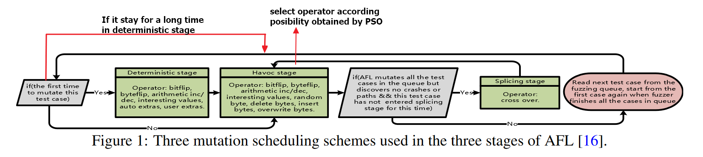

# MOPT

MOpt是针对传统Mutation based fuzz的变异策略的一种改进Fuzzer，主要通过PSO算法优化了变异操作的选取

## 0x1.核心思路

### 0x1.1.传统Fuzz的变异策略存在的问题

- Different operators’ efficiency varies.
  不同Mutation operators的效率不同
- One operator’s efficiency varies with target programs.
- One operator’s efficiency varies over time.
- The scheduler incurs performance overhead.
- Unbalanced data for machine learning.

这些问题，要求我们用更智能化的方法选择各种Mutation operators

### 0x1.2.MOpt

将每个Mutation operators视为PSO中的一个particle，寻找其最佳概率


#### 0x1.2.1.一些参数

- L~best~ : particle在概率空间中的最佳(对应的优秀测试用例更多)分布
- G~best~ : 区别于传统粒子群算法，在计算时，实际上所有particle分布在不同的概率空间，不可能存在一个传统意义上的适应于所有particle的G~best~，那么同样从全局意义考虑，将所有particle对应的interesting test cases数量之和，作为整个swarm的globel~eff~，而每个partcle在globel~eff~ 中的比例，作为其对应的G~best~

#### 0x1.2.2.overview

在每一次fuzz过程中额外的三个task:

- 更新每个particle的L~best~ 为效率最高的eff~best~
- 更新每个particle的G~best~
- 选择最好的swarm指导fuzzing(避免陷入局部最优点)  // 一个疑问

同时，在每次迭代最后，还要按照PSO算法，更行每个particle的position

```tex
vnow[Si][Pj] ←w × vnow[Si][Pj] 
    		+r × (Lbest [Si][Pj] − xnow[Si][Pj]) 
    		+r × (Gbest [Pj] − xnow[Si][Pj]). (3) 
    
xnow[Si][Pj] ← xnow[Si][Pj] + vnow[Si][Pj]. (4)
```

#### 0x1.2.3.Main Framework

**PSO Initialization Module:**

负责PSO相关参数的初始化:

- 设置每个swarm中的每个particle的*X~now~* 为随机值，并保证每个群中的X~now~之和为1
- 把每个particle的*V~now~*设置为0.1
- 设置每个particle的*eff~now~*为0
- 设置每个particle的*G~best~*和*L~best~*为0.5

**Pilot Fuzzing Module**

对多个swarm找最优概率分布

**Core Fuzzing Module**

针对一个swarm找最优概率分布

**PSO Updating Module**

根据PSO算法迭代*V~now~*和*X~now~*

**Pacemaker Fuzzing Mode**

主要是针对Mutation based fuzz的deterministic stage，对于特定的条件，酌情跳过，deterministic stage，以提高效率。

对于上述模块的具体分析放在源代码分析中。

## 0x2.源代码分析

主要分析相对于AFL算法所作的改进， 以源代码中的中文注释为主要形式


差异部分:

原调用链：

main->fuzz_one

现调用链:

main->fuzz_one->normal_fuzz / pivot_fuzz / core_fuzz / pso_update

主要更改了afl-fuzz.c->fuzz_one->havoc环节的逻辑


整体思路(红线部分为我自己添加的MOpt思路，原图来自MOpt原论文，表明AFL的mutatition stage):



### 0x2.1.main()

关注主要逻辑，根据需要，选择性的忽视了一些无关主要逻辑的代码

**新增参数判断**

-L 参数负责控制转入Pacemaker Fuzzing Mode的时间。

```c

        case 'L': { /* MOpt mode */
		// L 参数负责控制转入Pacemaker Fuzzing Mode的时间
        // -L 30 相当于24小时左右
        // ref: https://github.com/puppet-meteor/MOpt-AFL
            //if (limit_time_sig)  FATAL("Multiple -L options not supported");
            limit_time_sig = 1;
			// 
			if (sscanf(optarg, "%llu", &limit_time_puppet) < 1 ||
				optarg[0] == '-') FATAL("Bad syntax used for -L");

			u64 limit_time_puppet2 = limit_time_puppet * 60 * 1000;

			if (limit_time_puppet2 < limit_time_puppet ) FATAL("limit_time overflow");
				limit_time_puppet = limit_time_puppet2;

			SAYF("limit_time_puppet %llu\n",limit_time_puppet);

			if (limit_time_puppet == 0 )
			    key_puppet = 1;


        }
        break;
```

**针对MOpt的全局变量的初始化**

对应于前文的**PSO Initialization Module** 具体内容可以查看前文

```c
  {                //initialize swarms
        int i;
        int tmp_swarm = 0;
        swarm_now = 0;

        if (g_now > g_max) g_now = 0;
                w_now = (w_init - w_end)*(g_max - g_now) / (g_max)+w_end;

        for (tmp_swarm = 0; tmp_swarm < swarm_num; tmp_swarm++)
        {
                double total_puppet_temp = 0.0;
                swarm_fitness[tmp_swarm] = 0.0;

                for (i = 0; i < operator_num; i++)
                {
                        stage_finds_puppet[tmp_swarm][i] = 0;
                        probability_now[tmp_swarm][i] = 0.0;
                        x_now[tmp_swarm][i] = ((double)(random() % 7000)*0.0001 + 0.1);
                        total_puppet_temp += x_now[tmp_swarm][i];
                        v_now[tmp_swarm][i] = 0.1;
                        L_best[tmp_swarm][i] = 0.5;
                        G_best[i] = 0.5;
                        eff_best[tmp_swarm][i] = 0.0;

                }


                for (i = 0; i < operator_num; i++) {
                        stage_cycles_puppet_v2[tmp_swarm][i] = stage_cycles_puppet[tmp_swarm][i];
                        stage_finds_puppet_v2[tmp_swarm][i] = stage_finds_puppet[tmp_swarm][i];
                        x_now[tmp_swarm][i] = x_now[tmp_swarm][i] / total_puppet_temp;
                }

                double x_temp = 0.0;

                for (i = 0; i < operator_num; i++)
                {
                        probability_now[tmp_swarm][i] = 0.0;
                        v_now[tmp_swarm][i] = w_now * v_now[tmp_swarm][i] + RAND_C * (L_best[tmp_swarm][i] - x_now[tmp_swarm][i]) + RAND_C * (G_best[i] - x_now[tmp_swarm][i]);

                        x_now[tmp_swarm][i] += v_now[tmp_swarm][i];

                        if (x_now[tmp_swarm][i] > v_max)
                                x_now[tmp_swarm][i] = v_max;
                        else if (x_now[tmp_swarm][i] < v_min)
                                x_now[tmp_swarm][i] = v_min;

                        x_temp += x_now[tmp_swarm][i];
                }

                for (i = 0; i < operator_num; i++)
                {
                        x_now[tmp_swarm][i] = x_now[tmp_swarm][i] / x_temp;
                        if (likely(i != 0))
                                probability_now[tmp_swarm][i] = probability_now[tmp_swarm][i - 1] + x_now[tmp_swarm][i];
                        else
                                probability_now[tmp_swarm][i] = x_now[tmp_swarm][i];
                }
                if (probability_now[tmp_swarm][operator_num - 1] < 0.99 || probability_now[tmp_swarm][operator_num - 1] > 1.01)
                    FATAL("ERROR probability");
        }

        for (i = 0; i < operator_num; i++)
        {
                core_operator_finds_puppet[i] = 0;
                core_operator_finds_puppet_v2[i] = 0;
                core_operator_cycles_puppet[i] = 0;
                core_operator_cycles_puppet_v2[i] = 0;
                core_operator_cycles_puppet_v3[i] = 0;
        }
  }
```

### 0x2.2.select_algorithm()

根据PSO获得的概率分布，选择不同的变异算法

```c
int select_algorithm(int extras) {

  int i_puppet, j_puppet;
  //double total_puppet = 0.0;
//srandom(time(NULL));

    u32 seed[2];

    ck_read(dev_urandom_fd, &seed, sizeof(seed), "/dev/urandom");

    srandom(seed[0]);

  //double sele = ((double)(random()%10000)*0.0001);
  //SAYF("select : %f\n",sele);
  j_puppet = 0;
  int operator_number = operator_num;
  if (extras < 2) operator_number = operator_number - 2;
  double range_sele = (double)probability_now[swarm_now][operator_number - 1];
  double sele = ((double)(random() % 10000) * 0.0001 * range_sele);
    
// 这里的probability_now由pso_uadating()确定
// probability_now是一个概率的前缀和数组，
// 最后一位也就是probability_now[swarm_now][operator_number - 1]应该为1
    
  for (i_puppet = 0; i_puppet < operator_number; i_puppet++)
  {
      if (unlikely(i_puppet == 0))
      {
          if (sele < probability_now[swarm_now][i_puppet])
            break;
      }
      else
      {
          if (sele < probability_now[swarm_now][i_puppet])
          {
              j_puppet =1;
              break;
          }
      }
  }
    
  // 由上面对于sele的分析，可以知道这里是按照对应的概率设置i_puppet
  // i_puppet对应选择到的操作
    
  if ((j_puppet ==1 && sele < probability_now[swarm_now][i_puppet-1]) || (i_puppet + 1 < operator_num && sele > probability_now[swarm_now][i_puppet +  1]))
    FATAL("error select_algorithm");
  return i_puppet;
}
```

### 0x2.2.fuzz_one()

fuzz_one() 是完成Mutation operators的核心流程，在main()中每一次fuzz循环中被调用

```c
static u8 fuzz_one(char** argv) {
	int key_val_lv = 0;
	if (limit_time_sig == 0)
		key_val_lv = normal_fuzz_one(argv);
    	// normal_fuzz_one() 是原来AFL的fuzz_one()
	else
	{
		if (key_module == 0)
			key_val_lv = pilot_fuzzing(argv);
        	// 对应0x1.2.3.Main Framework 中的pilot fuzzing module
		else if (key_module == 1)
			key_val_lv = core_fuzzing(argv);
        	// 对应core fuzzing module
		else if (key_module == 2)
			pso_updating();
        	// 对应PSO updating module
	}

	return key_val_lv;	
}
```

### 0x2.3.pilot_fuzzing()

这是整个MOpt的核心模块，他是在原AFL的基础上修改得到的，所以主要分析和原AFL的差异部分。

core_pilot与此类似，所以不做单独分析

#### 0x2.3.1.Pacemaker Fuzzing Mode

由于deterministic stage的小型改动在前期比较有用，在后期长时间处于deterministic stage会导致效率下降，所以在原fuzz_one() 直接跳到havoc_stage() 的逻辑后面，增加一个时间判断，判断是否要直接跳到havoc_stage()

```c
// line 6999 in afl_fuzz.c

cur_ms_lv = get_cur_time();
// 获取当前时间
if (!(key_puppet == 0 && ((cur_ms_lv - last_path_time < limit_time_puppet) 
        (last_crash_time != 0 && cur_ms_lv - last_crash_time < limit_time_puppet) || last_path_time == 0)))
// 如果距离上一次crash或者找到新路径的时间，超过了通过-L参数设置的limit_time_puppet
// 说明长时间陷入了deterministic stage
// 直接跳过deterministic stage进入havoc_stage()
{
        key_puppet = 1;
        goto pacemaker_fuzzing;
}
```


#### 0x2.3.2.Mutation operators select

在havoc阶段，要进行变异策略的选择，相比于原来的随机选择，MOpt根据PSO得到的概率分布进行策略的选择

```c
// line 8165 in afl-fuzz.c

switch (select_algorithm( extras_cnt + a_extras_cnt )) 
```

#### 0x2.3.3.Before return

返回前新增的一些变化

```c
if (key_puppet == 1)
//一个小型的flag
//在前面pacemaker的跳转时被设置为1
{
        if (unlikely(queued_paths + unique_crashes > ((queued_paths + unique_crashes)*limit_time_bound + orig_hit_cnt_puppet)))
        {
                key_puppet = 0;
                cur_ms_lv = get_cur_time();
                new_hit_cnt = queued_paths + unique_crashes;
                orig_hit_cnt_puppet = 0;
                last_limit_time_start = 0;
        }
}
// 还原并更新一些变量

if (unlikely(tmp_pilot_time > period_pilot))
{
        total_pacemaker_time += tmp_pilot_time;
        new_hit_cnt = queued_paths + unique_crashes;
        swarm_fitness[swarm_now] = (double)(total_puppet_find - temp_puppet_find) / ((double)(tmp_pilot_time)/ period_pilot_tmp);
        tmp_pilot_time = 0;
        temp_puppet_find = total_puppet_find;

        u64 temp_stage_finds_puppet = 0;
        for (i = 0; i < operator_num; i++)
        {
                double temp_eff = 0.0;

                if (stage_cycles_puppet_v2[swarm_now][i] > stage_cycles_puppet[swarm_now][i])
                        temp_eff = (double)(stage_finds_puppet_v2[swarm_now][i] - stage_finds_puppet[swarm_now][i]) /
                        (double)(stage_cycles_puppet_v2[swarm_now][i] - stage_cycles_puppet[swarm_now][i]);
                if (eff_best[swarm_now][i] < temp_eff)
                {
                        eff_best[swarm_now][i] = temp_eff;
                        L_best[swarm_now][i] = x_now[swarm_now][i];
                }
            	// 找到particle对应的历史最优概率分布
				// 更新L_best
                stage_finds_puppet[swarm_now][i] = stage_finds_puppet_v2[swarm_now][i];
                stage_cycles_puppet[swarm_now][i] = stage_cycles_puppet_v2[swarm_now][i];
                temp_stage_finds_puppet += stage_finds_puppet[swarm_now][i];
            	// 更新一些和计算 生成的好的test case数量 相关的变量
        }

        swarm_now = swarm_now + 1;
        if (swarm_now == swarm_num)
        {
                key_module = 1;
                for (i = 0; i < operator_num; i++)
                {
                        core_operator_cycles_puppet_v2[i] = core_operator_cycles_puppet[i];
                        core_operator_cycles_puppet_v3[i] = core_operator_cycles_puppet[i];
                        core_operator_finds_puppet_v2[i] = core_operator_finds_puppet[i];
                }
				// 更新一些和计算 生成的好的test case数量 相关的变量
                double swarm_eff = 0.0;
                swarm_now = 0;
                for (i = 0; i < swarm_num; i++)
                {
                        if (swarm_fitness[i] > swarm_eff)
                        {
                                swarm_eff = swarm_fitness[i];
                                swarm_now = i;
                        }
                }
            	// 选择最好的swarm
                if (swarm_now <0 || swarm_now > swarm_num - 1)
                        PFATAL("swarm_now error number  %d", swarm_now);

        }
        

}

```


### 0x2.4.pso_updating()

```c
void pso_updating(void) {

	g_now += 1;
	if (g_now > g_max) g_now = 0;
	w_now = (w_init - w_end)*(g_max - g_now) / (g_max)+w_end; 
	int tmp_swarm, i, j;
	u64 temp_operator_finds_puppet = 0;
	for (i = 0; i < operator_num; i++)
	{
		operator_finds_puppet[i] = core_operator_finds_puppet[i];
		
		for (j = 0; j < swarm_num; j++)
		{
			operator_finds_puppet[i] = operator_finds_puppet[i] + stage_finds_puppet[j][i];
		}
		temp_operator_finds_puppet = temp_operator_finds_puppet + operator_finds_puppet[i];
	}
	// 计算变异产生的好test cese的个数
    // 为更新G_best()做准备
	for (i = 0; i < operator_num; i++)
	{
		if (operator_finds_puppet[i])
			G_best[i] = (double)((double)(operator_finds_puppet[i]) / (double)(temp_operator_finds_puppet)); 
	}
    // 更新G_best()，即PSO中的全局最优分布

	for (tmp_swarm = 0; tmp_swarm < swarm_num; tmp_swarm++)
	{
		double x_temp = 0.0;
		for (i = 0; i < operator_num; i++)
		{
			probability_now[tmp_swarm][i] = 0.0;
			v_now[tmp_swarm][i] = w_now * v_now[tmp_swarm][i] + RAND_C * (L_best[tmp_swarm][i] - x_now[tmp_swarm][i]) + RAND_C * (G_best[i] - x_now[tmp_swarm][i]);
			x_now[tmp_swarm][i] += v_now[tmp_swarm][i];
			if (x_now[tmp_swarm][i] > v_max)
				x_now[tmp_swarm][i] = v_max;
			else if (x_now[tmp_swarm][i] < v_min)
				x_now[tmp_swarm][i] = v_min;
			x_temp += x_now[tmp_swarm][i];
		}
		// 根据pso算法更新v_now数组和x_now数组
		for (i = 0; i < operator_num; i++)
		{
			x_now[tmp_swarm][i] = x_now[tmp_swarm][i] / x_temp;
			if (likely(i != 0))
				probability_now[tmp_swarm][i] = probability_now[tmp_swarm][i - 1] + x_now[tmp_swarm][i];
			else
				probability_now[tmp_swarm][i] = x_now[tmp_swarm][i];
		}
        // 设置probablility_now为前缀和数组
        // 供select_algorithm使用
		if (probability_now[tmp_swarm][operator_num - 1] < 0.99 || probability_now[tmp_swarm][operator_num - 1] > 1.01) FATAL("ERROR probability");
	}
	swarm_now = 0;
	key_module = 0; 
}
```

