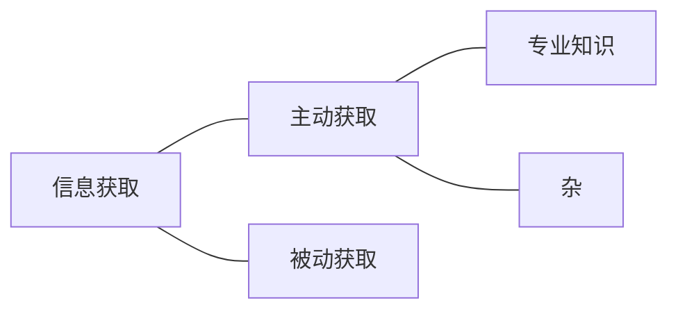

# 信息获取

//持续更新完善ing

这是我关于信息素养的第一篇文章。在我看来，在当今社会最重要的能力就是获取、处理、管理以及
分析和总结信息并在此基础上形成输出的能力，而我也将按这个顺序组织出我个人的信息管理体系。

本系列主要思路来源：罗昭峰《文献管理与信息分析》

在这个流程中，最开始也是最基础的部分就是信息获取

## 主动获取

### 专业知识

#### [一]安全领域

#### 1.书籍

书籍是快速了解一个领域最好的方法。我个人观点，国内大部分课程信息密度太低，所以我个人偏爱看书的方式学习

- [鸠摩搜索](https://www.jiumodiary.com/)
  电子书相关

#### 2.一些网站

- [GitHub](https://github.com/)
  著名代码托管平台

#### 3.一些论坛/新闻

- 微信公众号：看雪学院
  会有一些漏洞的演示

#### 4.前沿

- 安全领域四大顶会
  - [Technical Sessions | USENIX](https://www.usenix.org/conference/usenixsecurity14/technical-sessions)
  - [IEEE Symposium on Security and Privacy and Euro S&P (ieee-security.org)](http://www.ieee-security.org/TC/SP-Index.html)
  - [NDSS Symposium – The Network and Distributed System Security Symposium (NDSS) (ndss-symposium.org)](https://www.ndss-symposium.org/)
  - [ACM CCS (sigsac.org)](http://www.sigsac.org/ccs.html)
- 论文
  - [Sci-hubs](https://sci-hub.hkvisa.net/)
  - 图书馆官网
- 各类数据库

#### 5.官方文档

- Zeal
  快速查阅各种官方文档

#### [二]其他

- [心晴网](http://www.ixinqing.com/)
  心理学电子书
- [Index—The Stacks project (columbia.edu)](https://stacks.math.columbia.edu/)
  数学领域的开源尝试

### 杂

杂项主要指零碎知识的获取，包括遇到的各种问题等

#### 1. 搜索引擎的使用

**个人使用习惯：**中文搜索：bing国内版；英文搜索：Google

//这些点来源文章忘记了

- **Use the tabs**
- **Use quotes：**
  ** 引号将之识别为整体，如**“Puppy Dog Sweaters”**，搜索Puppy Dog Sweaters，反之分开搜索
- **Use a hyphen to exclude words：
   Mustang**-**cars** : search for mustangs but to remove any results that have the word “car” in it
- **Use a colon to search specific sites:
   **Sidney Crosby site:nhl.com** : This will search for all content about famous hockey player Sidney Crosby, but only on NHL.com
- **Find a page that links to another page：
   **link:www.whu.edu.cn
- **Use the asterisk wildcard
   “Come \* right now \* me**” :  Google search will search for that phrase knowing that the asterisks can be any word
- **Find sites that are similar to other sites：
   **related:amazon.com
- **Use Google search to do math**
   **8 \* 5 + 5**
- **Search for multiple words at once** **chocolate OR white chocolate**
- **Search a range of numbers** **What teams have won the Stanley Cup ..2004 **:
  the search will toss back the team that won the Stanley Cup in 2004. The two dots with only one number will tell the search that you don’t need anything before or after 2004 **41..43**   :    Google will search for the numbers 41, 42, and 43

- **Find a specific file** \* search term here \* **filetype:pdf**

- **Keep it simple**

- **Gradually add search terms**

- **Use words that websites would use**

- **Use words that websites would use**

- **Use important words only**

- **Google search has shortcuts** **Weather \*zip code\***   
  This will show you the weather in the given zip code. You can also use town and city names instead of area codes, but it may not be as accurate if there are multiple area codes in the city. **What is \*celebrity name\* Bacon Number**   This is a fun little one that will tell you how many connections any given celebrity has to famed actor Kevin Bacon. The popular joke, Six Degrees of Kevin Bacon, is that no actor is more than 6 connections away from Kevin Bacon. Mark Zuckerberg has a Bacon Number of 3. **What is the definition of \*word\* or Define: \*word\***    This will display the definition of a word. **Time \*place***    This will display the time in whatever place you type in. You can check any stock by **typing its ticker name** into Google. If you search for GOOG, it will check the stock prices for Google.

- **Spelling doesn’t necessarily matter**

- **Use descriptive words**

- **Find a specific file**
  \*search term here\* filetype:pdf

- **Money and unit conversions** 
  miles to km – This will convert miles to kilometers. You can put numbers in front to convert a certain number. Like “10 miles to km” will show you how many kilometers are in 10 miles. USD to British Pound Sterling – This will convert a US dollar to British pounds. Like the measurements above, you can add numbers to find exact conversions for a certain amount of money.

- **Track your packages**

#### 2.本地搜索软件

- Everything

#### 3.各类网站

- [StackOverflow](https://stackoverflow.com/)
  编程相关问答社区，编程相关问题回答质量高、解决概率大，提问需要遵守相关规范
- [Stanford Encyclopedia of Philosophy](https://plato.stanford.edu/)
  斯坦福大学的一个哲学名词解释库

- [Quora](https://www.quora.com/)
  综合类问答社区，宽泛性问题可以一观
- [知乎](https://www.zhihu.com/hot)
  综合类问答社区，趣味性问题可以一观
- [WiKi](https://wuu.wikipedia.org/)
  著名百科类网站

- [WikiHow](https://zh.wikihow.com/)
  没有什么用但是很有趣的生活小妙招

## 被动获取

主动获取的局限性是你不可能获取你不知道的知识，所以被动获取就很有必要了

#### 1. RSS

本人使用gReader
整合了各类新闻和相关论坛