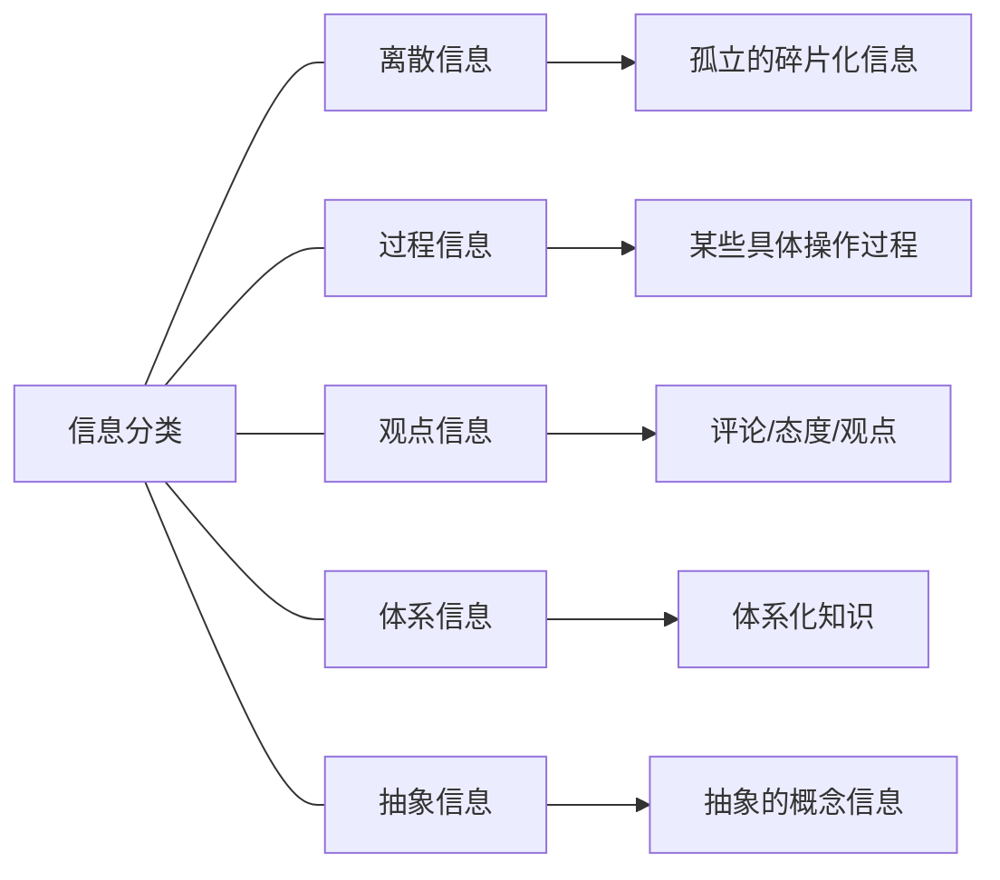

# 信息管理

当获取信息后，其次的任务就是对信息的管理以及处理，而信息管理的前提就是信息分类

## 信息分类

## 信息处理

对于我个人的信息管理体系：

- **Zotero**
  用于论文网页等的留档以及管理
- **思源笔记**
  集合了双链和体系化笔记的功能，便于个人知识体系的形成
- **MicrosoftEdge收藏**
  各种实用网页索引，以前各种页面网站的各自的收藏混杂，导致管理混乱，于是决定统一将网页交由浏览器收藏管理
- **博客**
  个人信息的体系化/离散输出，实践的记录
- **GitHub**
  可复用代码，脚本的管理，以及开源程序的关注

同时，在以上管理体系的基础上，我同时还在推进个人信息备份工作。包括本地备份、远程备份，最近租了一个服务器，预备进行数据备份工作，主要应对互联网上经常会有的删帖一些现象，防止信息丢失

#### 1.离散信息

对于离散信息，及一些论文、文章之类的我的管理如下

- 用Zotero归档，形成备份
- 思源笔记上提取主要观点记录成离散笔记--记录相关tag
- 定时将相同领域的双链连接的离散知识进行逻辑性整合，写成博客输出

#### 2.过程信息

即一些操作记录，如服务器配置。某软件使用

- 思源笔记记录
- 自行实验，用博文记录过程

#### 3.观点信息

一些观点/评论

- 用Zotero归档
- 思源笔记整理，用表格化结构化的组织方法记录
- 在需要时进行可视化处理和分析，整理成文章输出

//这个点其实是偏人文社科领域的研究方法，实际上，我还没有实际对观点信息进行操作，需要留待以后完善

#### 4.体系知识

一个领域的体系化的知识，典型的如书籍和课程

- 思源笔记写作逻辑化体系笔记
- 定时复习

#### 5.抽象信息

- Zotera归档
- 内化/比喻法